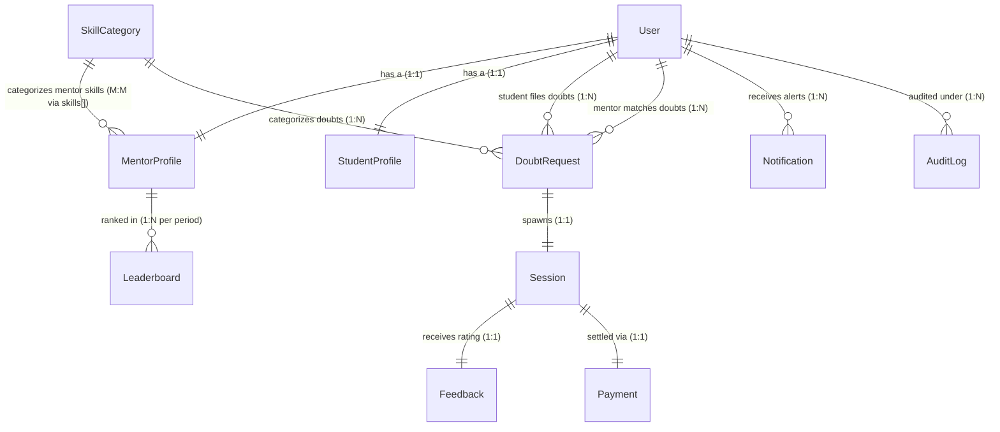

# SolveX — Comprehensive Database Schema & Backend Architecture Guide
> **Student Doubt Resolution & Live Mentor Matching Platform**

Welcome to the official database schema and implementation blueprint for **SolveX**. This document provides an exhaustive, field-by-field explanation of the database architecture, explains the relationships and integrity constraints between models, handles edge cases to ensure scalability, and details a step-by-step roadmap for downstream backend development.

---

## 📁 Database File Structure

The schema is modularly structured in the `schema/` directory, allowing easy maintenance and isolation of concerns:

```text
schema/
├── index.js                  ← Barrel export (import all models from here)
├── 01_users.js               ← Base User (Authentication, security, and roles - OTP in Redis)
├── 02_mentor_profile.js      ← Mentor extended profile (skills, availability, ratings)
├── 03_student_profile.js     ← Student extended profile (subscription, learning goals)
├── 04_skill_categories.js    ← Hierarchical skill/doubt taxonomy
├── 05_sessions.js            ← Full session lifecycle (scheduled vs instant, extensions)
├── 06_doubt_requests.js      ← Doubt matching queue (TTL matching, broadcast rounds)
├── 07_notifications.js       ← Multi-channel notification log (with backoff retries)
├── 08_feedback.js            ← Post-session feedback & ratings (WhatsApp quick-replies)
├── 09_payments.js            ← Payments, subscriptions & payouts (float-safe paise)
├── 10_leaderboard.js         ← Mentor rankings & gamification (weekly, monthly, global)
└── 11_audit_logs.js          ← Immutable security & system audit trail
```

---

## 🗺️ Entity Relationship Diagram & Core Relationships



### Explaining the Relational Integrity & Cascades
1. **User ↔ Profile 1:1 Linkages:** `MentorProfile` and `StudentProfile` reference `User` via the `userId` field. To retrieve user credentials alongside their profiles, use standard Mongoose `.populate()`.
2. **Double Reference in Sessions:** The `Session` model contains two direct references to `User`: `student` and `mentor`. This allows rapid lookup of a user's active session history without querying profile tables.
3. **Skill Taxonomies:** `SkillCategory` is a self-referencing tree model. When a student chooses a learning goal, or a mentor lists their skills, they reference `SkillCategory` via its `_id`.
4. **Doubt-to-Session Conversion:** Once a `DoubtRequest` changes status from `broadcasting` to `matched` (meaning a mentor accepted it), a corresponding `Session` is generated. Both documents reference each other to support two-way traversal.
5. **Feedback & Settlement:** After a `Session` is completed, its associated `Feedback` and `Payment` refer back to it. A Mongoose virtual property or a controller-level update flags the `Session` with these references to block duplicate submittals.

---

## 📋 Comprehensive Model & Property Breakdown

This section details every single field in every database collection, describing their validation, state transformations, and role in the platform.

---

### 1. `01_users.js` — The Core User Model
The gateway for all roles (`student`, `mentor`, `admin`, `superadmin`). It uses a single collection for unified authentication while separating extended attributes into auxiliary profile tables.

> [!NOTE]
> **Important Update:** OTP codes and their expiration limits are now stored and managed in a fast Redis cache store rather than MongoDB. This reduces disk I/O, speeds up authorization loops, and simplifies our Mongo documents.

#### 🛡️ Properties:
*   `fullName` (String): Trimmed, constrained to $2 \text{--} 100$ characters. Ensures clean name displays across the frontend.
*   `email` (String): Forced lowercase, trimmed, validated via a regex, and indexed. Combined with `isDeleted` to enforce uniqueness only among active users.
*   `phone` (Object):
    *   `phone.countryCode` (String): Defaults to `+91` (India). Validated against standard country dialing patterns.
    *   `phone.number` (String): Constrained to $7 \text{--} 15$ digits for national and international phone matching.
    *   `phone.isVerified` (Boolean): Flagged after successful mobile OTP confirmation. Used for SMS/WhatsApp alert dispatch verification.
*   `passwordHash` (String): **`select: false`** by default. Prevents accidental exposure of password hashes in general JSON responses.
*   `avatar` (Object): Holds S3 or Cloudinary storage pointers (`url`, `publicId`).
*   `role` (String): String enum (`student`, `mentor`, `admin`, `superadmin`). Used by routing middlewares to enforce role-based access control (RBAC).
*   `refreshTokens` (Array): Supports multi-device login:
    *   `token` (String): Cryptographically secure token (`select: false`).
    *   `deviceInfo` / `ip` (String): Captured during authentication for security audit trails and session terminations.
    *   `createdAt` / `expiresAt` (Date): Enables token expiration routines.
*   `isEmailVerified` (Boolean): Flagged after the user clicks their verification email link.
*   `loginAttempts` (Number) / `lockUntil` (Date): Brute-force protection tracking. If login attempts exceed a system limit, the account is temporarily locked.
*   `oauthProviders` (Array): Tracks social logins with external provider IDs and access tokens.
    *   `provider` (String): Restricted to `google` only for OAuth social signin.
    *   `providerId` / `accessToken` (String)
*   `passwordResetToken` / `passwordResetExpiry` (String / Date): Used for secure password recovery.
*   `status` (String): State engine constraint: `pending_verification`, `active`, `suspended`, or `deactivated`.
*   `isDeleted` (Boolean) / `deletedAt` (Date): Implements a "Soft Delete" mechanism. A pre-save Mongoose query hook intercepts `find` and `findOne` and appends `{ isDeleted: false }` so that soft-deleted entries are transparently omitted from query results.

#### ⚡ Performance Indexes:
*   `{ email: 1, isDeleted: 1 }` (Compound): Speeds up authentication lookups.
*   `{ role: 1, status: 1 }` (Compound): Ideal for back-office admin dashboard aggregations.

---

### 2. `02_mentor_profile.js` — Mentor Extended Profile
Extends the base User collection for users with the `mentor` role. Stores availability schedules, credentials, earnings statistics, and quality performance markers.

#### 🛡️ Properties:
*   `userId` (ObjectId): Unique reference linking back to the `User` document.
*   `bio` / `tagline` (String): Mentor credentials displayed to students.
*   `yearsOfExperience` (Number): Used for search filters and payout calculations.
*   `skills` (Array of Sub-schemas):
    *   `category` (ObjectId): Points to the verified `SkillCategory`.
    *   `proficiencyLevel` (String): `beginner`, `intermediate`, or `expert`.
    *   `isVerified` (Boolean): Indicates whether the mentor passed the credential review for this specific skill.
    *   `verifiedAt` / `verifiedBy` (Date / ObjectId): Admin verification metadata.
*   `cameraVerification` (Object): Captures hardware/identity integrity checks:
    *   `status` (String): `not_started`, `pending`, `approved`, `rejected`, or `expired`.
    *   `idDocumentUrl` / `selfieVideoUrl` (String): Media references for manual admin verification.
    *   `attemptCount` (Number): Enforces limits on verification retries.
*   `approvalStatus` (String): Overall platform clearance: `pending`, `approved`, `suspended`, or `rejected`.
*   `isAvailableNow` (Boolean): Instant session signal. Used by the matchmaking service to identify mentors ready for real-time dispatch.
*   `weeklyAvailability` (Array of Sub-schemas): Scheduled sessions timeline. Details timeslots (`startTime`, `endTime` matching `HH:MM`) paired with a `dayOfWeek` (0-6) and `timezone`.
*   `sessionBufferMinutes` (Number): Guaranteed rest period between back-to-back live sessions.
*   `preferredSessionDuration` (Number): Preferred default duration (15, 30, 45, 60, 90, or 120 minutes).
*   `earnings` (Object): Denormalized financial snapshot. Avoids expensive database-wide aggregations during checkout:
    *   `totalEarned` / `platformFeeDeducted` / `pendingPayout` (Number): Expressed in currency base unit (paise) to prevent float-rounding bugs.
    *   `bankDetails` (Object): Encrypted bank information (`accountNumber`, `ifscCode` marked `select: false`) and public `upiId` for automated payouts.
*   `stats` (Object): Performance tracking attributes:
    *   `totalSessionsCompleted` / `totalStudentsHelped` (Number): Increment on successful session termination.
    *   `consecutiveRejections` (Number): Counts how many broadcasting matching rounds a mentor ignored or rejected. If this value reaches 5, the virtual property `isQualityFlagged` resolves to `true` and raises an admin alert.
    *   `averageRating` / `totalRatingsCount` (Number): Running average used for search ranking algorithms.
*   `badges` (Array): Awarded badges like `top_mentor` or `fast_responder` for gamification.

#### ⚡ Performance Indexes:
*   `{ approvalStatus: 1, isAvailableNow: 1 }` (Compound): Speeds up instant doubt matching queries.
*   `{ "skills.category": 1, "skills.isVerified": 1 }` (Compound): Optimizes skill-targeted broadcasts.

---

### 3. `03_student_profile.js` — Student Extended Profile
Extends the base User collection for users with the `student` role. Focuses on learning objectives, active plans, billing customer IDs, and learning metrics.

#### 🛡️ Properties:
*   `userId` (ObjectId): Links back to the base `User` document.
*   `educationLevel` (String): Level enum (`high_school`, `undergraduate`, etc.). Helps tailor mentor matching.
*   `learningGoals` (Array): Lists the student's target `SkillCategory` targets tagged with `priority` levels (`low`, `medium`, `high`).
*   `preferredTools` (Array): Preferred tools for remote sessions (`google_meet`, `live_coding`, `whiteboard`, etc.).
*   `subscription` (Object):
    *   `plan` (String): Plan level: `free`, `basic`, `pro`, or `enterprise`.
    *   `startDate` / `endDate` (Date): Defines validity periods.
    *   `stripeCustomerId` (String): Placed inside a secure `select: false` wrapper for Stripe billing integrations.
*   `sessionCredits` (Number): Pre-paid credits for session-based plans. Checked by billing services before initiating a booking.
*   `stats` (Object): Tracks standard analytics (`totalSessionsAttended`, `totalDoubtsFiled`, `totalAmountSpent`) and a list of `favouriteMentors` for priority matching.

#### ⚡ Virtual Properties:
*   `isSubscriptionActive` (Boolean): Dynamically evaluates if the plan is `free` or if the system clock is prior to the `endDate` timestamp.

---

### 4. `04_skill_categories.js` — Hierarchical Taxonomy
Manages platform categories (e.g., Computer Science → Languages → JavaScript). It is implemented as an optimized self-referencing tree.

#### 🛡️ Properties:
*   `name` (String): Unique category label (e.g., "Sliding Window").
*   `slug` (String): Unique, URL-friendly index path. Must match `/^[a-z0-9-]+$/`.
*   `parent` (ObjectId): Refers back to the parent `SkillCategory`.
*   `ancestorSlugs` (Array of Strings): Full hierarchical breadcrumb (e.g., `["dsa", "arrays", "sliding-window"]`). Enables rapid subtree fetches using a single query.
*   `color` (String): Hex code validator (`/^#[0-9A-Fa-f]{6}$/`) for frontend styling.
*   `mentorCount` (Number): Denormalized counter. Incremented or decremented via background queues when mentors add/remove skills to avoid real-time count aggregates.
*   `isActive` (Boolean): Allows admins to soft-disable skill tracks without breaking existing session records.

---

### 5. `05_sessions.js` — Full Session Lifecycle
Captures the execution state, timings, extension requests, and communication details for both instant and scheduled student-mentor connections.

```
       [Created]
           │
           ▼
     ┌───────────┐
     │ scheduled │
     └─────┬─────┘
           │ (Time to start)
           ▼
┌──────────────────┐
│ waiting_to_start │
└──────────┬───────┘
           │ (Both parties join)
           ▼
       ┌───────┐
       │ live  │◄───────┐ (Extension Approved)
       └───┬───┘        │
           │            │
           ├────────────┴─ [Request Extension]
           │
           ├───────────────────────────────┐
           │ (Complete)                    │ (No-show timeout)
           ▼                               ▼
     ┌───────────┐                   ┌──────────┐
     │ completed │                   │ no_show  │
     └───────────┘                   └──────────┘
```

#### 🛡️ Properties:
*   `student` / `mentor` (ObjectId): References to the base `User` documents.
*   `doubtRequest` (ObjectId): Reference to the original matchmaking `DoubtRequest`.
*   `category` (ObjectId): Skill Category reference.
*   `sessionType` (String): `instant` or `scheduled`.
*   `scheduledAt` (Date): Set for scheduled bookings.
*   `startedAt` / `endedAt` (Date): Accurate log-in/log-out timestamps.
*   `plannedDurationMinutes` / `actualDurationMinutes` (Number): Used to calculate payouts and refund amounts.
*   `status` (String): State machine enum: `scheduled`, `waiting_to_start`, `live`, `completed`, `cancelled`, or `no_show`.
*   `noShowBy` / `cancelledBy` (String): Captures the party responsible for a cancellation or no-show (`student`, `mentor`, `admin`, or `system`).
*   `timeline` (Array of Sub-schemas): Append-only audit trail logging user activity (e.g., `student_joined`, `paused`, `mentor_left`).
*   `extensions` (Array of Sub-schemas): Supports real-time extensions during a live session:
    *   `requestedBy` (String) / `extraMinutes` (Number) / `status` (`pending`, `approved`, `rejected`).
*   `toolConfig` (Object): Configuration details for tools used during the session:
    *   `communicationMode` (`video`, `audio`, `chat`, etc.).
    *   `codingTool` (`live_share`, `codesandbox`, etc.).
    *   `meetingLink` / `roomId` (String): Integration URLs for communication tools (e.g., Google Meet API, Zoom API, daily.co, or WebRTC).
*   `isRecordingEnabled` / `recordingUrl` (String): Links to session recordings.
*   `recordingExpiresAt` (Date): Auto-purges recording records from storage after a set period.

#### ⚡ Performance Indexes:
*   `{ student: 1, status: 1, createdAt: -1 }` (Compound): Optimizes student session history lookups.
*   `{ mentor: 1, status: 1, createdAt: -1 }` (Compound): Optimizes mentor portal histories.
*   `{ status: 1, scheduledAt: 1 }` (Compound): Used by cron workers to identify sessions that are starting soon.

---

### 6. `06_doubt_requests.js` — Doubt Matching Queue
Manages the real-time matchmaking queue, including TTL expirations and response tracking for broadcast rounds.

#### 🛡️ Properties:
*   `student` (ObjectId): Reference to the student user requesting help.
*   `title` / `description` / `tags` (String / Array): Details of the doubt.
*   `category` (ObjectId): Targeted `SkillCategory` reference.
*   `attachments` (Array of Sub-schemas): Up to 5 uploaded resources (images, log files, or code snippets).
*   `sessionType` (String): `instant` or `scheduled`.
*   `status` (String): Queue state tracking: `pending`, `broadcasting`, `matched`, `cancelled`, or `expired`.
*   `expiresAt` (Date): Database-level TTL index (`expireAfterSeconds: 0`). Automatically transitions expired, unmatched requests to `expired` status to keep the queue clean.
*   `mentorResponses` (Array of Sub-schemas): Tracks candidate interactions during matching:
    *   `mentor` (ObjectId) / `respondedAt` (Date).
    *   `action` (`notified`, `accepted`, `rejected`, `ignored`, or `unavailable`).
    *   `rejectionReason` (String): Captures the reason for rejection to help improve routing quality.

---

### 7. `07_notifications.js` — Multi-Channel Notification Log
An audit-ready notification dispatcher that supports `in_app`, `whatsapp`, `email`, and `push` channels.

#### 🛡️ Properties:
*   `recipient` (ObjectId): Target user reference.
*   `type` (String): Enumerated notification triggers (e.g., `session_reminder_15min`, `payout_completed`).
*   `channels` (Array): Enabled channels (`in_app`, `whatsapp`, etc.) for this notification.
*   `title` / `body` (String): Notification text.
*   `whatsappTemplate` (Object): Contains template variables and configurations for the WhatsApp Cloud API.
*   `actionUrl` / `entityType` / `entityId` (String / ObjectId): Deep-link payloads for client applications.
*   `isRead` / `readAt` (Boolean / Date): Tracks read state for in-app badges.
*   `deliveryAttempts` (Array): Log of delivery attempts for diagnostic audits.
*   `overallStatus` (String): Combined dispatch state: `pending`, `delivered`, `partially_delivered`, or `failed`.
*   `nextRetryAt` (Date): Scheduled retry time for failed attempts. Checked by background workers using exponential backoff logic.
*   `expiresAt` (Date): TTL index that automatically purges old notification history after 30 days.

---

### 8. `08_feedback.js` — Post-Session Feedback
Stores session ratings and reviews. Integrates with quick-reply buttons (e.g., WhatsApp templates).

#### 🛡️ Properties:
*   `session` (ObjectId): Unique reference linking back to the completed `Session`.
*   `student` / `mentor` (ObjectId): References to the session participants.
*   `quickRating` (String): WhatsApp rating option: `BAD`, `GOOD`, or `VERY_GOOD`.
*   `quickRatingScore` (Number): Maps quick ratings to numeric scores: 1, 3, or 5.
*   `overallRating` (Number): Star rating (1-5). Synchronized with the quick rating score if the user responds via WhatsApp.
*   `detailedRating` (Object): Optional in-app ratings for specific performance categories: `communication`, `knowledgeDepth`, `punctuality`, and `helpfulness`.
*   `comment` (String): Detailed text review.
*   `submittedVia` (String): Submission channel (`whatsapp`, `in_app`, or `email`).
*   `isPublic` (Boolean): Flags whether the feedback is displayed on the mentor's public profile.
*   `mentorResponse` (Object): Allows mentors to post a reply to the feedback.
*   `editHistory` (Array): Tracks updates to the feedback, with a limit of 3 edits.
*   `adminReview` (Object): Flags disputed feedback for admin moderation.

---

### 9. `09_payments.js` — Payments, Subscriptions & Payouts
Handles financial transactions, including student bookings, subscription renewals, refunds, and mentor payouts.

#### 🛡️ Properties:
*   `payer` / `payee` (ObjectId): References to the users involved in the transaction.
*   `paymentType` (String): Transaction type: `session`, `subscription`, `mentor_payout`, `refund`, or `credit_purchase`.
*   `session` / `doubtRequest` (ObjectId): References to the related session or doubt request.
*   `originalPayment` (ObjectId): Links refund transactions back to the original payment record.
*   `currency` (String): ISO 4217 currency code (defaults to `INR`).
*   `amountInPaise` (Number): The total transaction amount in the smallest currency unit (e.g., paise for INR) to prevent floating-point rounding errors.
*   `platformFeePercent` / `platformFeeInPaise` (Number): Tracks the platform fee deduction at the time of transaction.
*   `mentorEarningsInPaise` (Number): The final calculated payout amount for the mentor.
*   `taxBreakdown` (Object): Records GST and TDS details for regulatory tax compliance.
*   `subscription` (Object): Details for subscription-type payments, including the target `plan` and coverage dates.
*   `status` (String): Transaction status state machine: `initiated`, `pending`, `success`, `failed`, `refunded`, `partially_refunded`, `disputed`, or `cancelled`.
*   `statusHistory` (Array): Immutable log of status transitions.
*   `gateway` (Object): Contains payment provider identifiers (e.g., Razorpay, Stripe) and webhook signatures.
*   `payoutMethod` / `payoutInitiatedAt` / `payoutSettledAt` (String / Date): Tracking metadata for mentor payouts.
*   `invoiceNumber` / `invoiceUrl` (String): Invoice tracking details.

#### ⚡ Performance Indexes:
*   `{ payer: 1, status: 1, createdAt: -1 }`: Fast user transaction history queries.
*   `{ "gateway.paymentId": 1 }` (Sparse): Speeds up webhook event lookups from payment gateways.

---

### 10. `10_leaderboard.js` — Mentor Leaderboards
Stores weekly, monthly, and all-time mentor performance rankings computed by background jobs.

#### 🛡️ Properties:
*   `mentor` (ObjectId): Reference to the mentor.
*   `period` (String): Leaderboard duration scope: `weekly`, `monthly`, or `all_time`.
*   `periodStart` / `periodEnd` (Date): Date boundaries for the leaderboard period.
*   `category` (ObjectId): Skill category reference (null for the global leaderboard).
*   `scores` (Object): Score breakdown used to calculate the ranking:
    *   `avgRating` (40% weight), `totalSessions` (20% weight), `responseRate` (20% weight), `studentRetentionRate` (10% weight), `feedbackQualityScore` (10% weight).
*   `compositeScore` (Number): The final calculated score used for ranking.
*   `rank` / `previousRank` / `rankChange` (Number): The mentor's current position, previous position, and rank change.
*   `badgesEarnedThisPeriod` (Array): Badges awarded based on leaderboard performance.
*   `expiresAt` (Date): TTL index that automatically purges old weekly and monthly leaderboard documents after 90 days.

---

### 11. `11_audit_logs.js` — Security & Audit Trail
An immutable, append-only log that records administrative and critical system actions.

#### 🛡️ Properties:
*   `actor` (Object): Identifies who performed the action (User ID, role, email snapshot, IP, and User Agent).
*   `action` (String): Enums for critical actions (e.g., `user_suspended`, `mentor_verification_approved`, `payment_override`).
*   `entity` (Object): Details of the affected entity (type, ID, and display name).
*   `before` / `after` (Mixed): Snapshots of the object state before and after the action. Used for rollback analysis without full event sourcing.
*   `reason` (String): Required reason for the action.
*   `severity` (String): Log severity classification: `info`, `warning`, or `critical`.
*   `expiresAt` (Date): TTL index that automatically purges logs after two years to maintain GDPR compliance.

#### 🔒 Security Guardrails:
```javascript
// Pre-save hook enforces log immutability
AuditLogSchema.pre(["updateOne", "updateMany", "findOneAndUpdate"], function () {
  throw new Error("AuditLog is immutable — updates are not allowed");
});
```

---

## ⚡ Future-Proofing: Design Patterns & Guardrails

To prevent future backend implementations from breaking these schemas, follow these architectural design patterns:

1.  **Strict Currency Handling:** Always store financial amounts in their smallest unit (e.g., `amountInPaise` for INR, or cents for USD) as Integers. Never use floating-point types for monetary values to avoid rounding errors.
2.  **Soft-Delete Safety:** Always check `isDeleted: false` when query filtering. The `User` schema includes pre-hooks for `find` and `findOne` to automate this filter:
    ```javascript
    UserSchema.pre("find", function() { this.where({ isDeleted: false }); });
    ```
    If you need to retrieve a soft-deleted record (e.g., for administrative audits), override this hook using `.find({ isDeleted: true })` or bypass it with a custom static query helper.
3.  **State Machine Transitions:** Always validate state transitions using Mongoose pre-save hooks or controller middleware to ensure valid flows. For example, a `Session` should not transition directly from `scheduled` to `completed` without first passing through `live`.
4.  **Audit Log Immutability:** Never modify or delete documents in the `AuditLog` collection. Enforce this via database permissions and application pre-save hooks.
5.  **Index Integrity:** Maintain the defined compound indexes in production. If you add new query paths, verify them with `.explain()` to ensure they use indexes and perform efficiently.

---

## 🚀 Step-by-Step Backend Implementation Guide

Follow this phased implementation plan to build out the backend services on top of these Mongoose schemas.

### Phase 1: Database Setup, Connections & Seeding
Create the base database connection configuration and write a seed script to populate initial categories.

1.  **Configure Database Connections:**
    Create a database configuration utility using Mongoose:
    ```javascript
    // config/db.js
    const mongoose = require("mongoose");

    const connectDB = async () => {
      try {
        await mongoose.connect(process.env.MONGODB_URI, {
          maxPoolSize: 50, // Optimize pool size for high-frequency queries
          minPoolSize: 10,
          socketTimeoutMS: 45000,
        });
        console.log("MongoDB connection established successfully.");
      } catch (error) {
        console.error("Database connection failure:", error.message);
        process.exit(1);
      }
    };
    module.exports = connectDB;
    ```
2.  **Develop the Skill Seed Script:**
    Write a script to populate initial `SkillCategory` hierarchies (e.g., "DSA" and its subcategories) to support development.
    ```javascript
    // scripts/seedSkills.js
    const connectDB = require("../config/db");
    const { SkillCategory } = require("../schema");

    const seed = async () => {
      await connectDB();
      // Clear existing categories
      await SkillCategory.deleteMany({});

      // Seed parent category
      const dsa = await SkillCategory.create({
        name: "Data Structures & Algorithms",
        slug: "dsa",
        description: "Core algorithms and data structures",
        color: "#6366f1",
      });

      // Seed child categories
      await SkillCategory.create({
        name: "Arrays",
        slug: "arrays",
        parent: dsa._id,
        ancestorSlugs: ["dsa"],
        description: "Array operations and algorithms",
      });

      console.log("Database seeding completed successfully.");
      process.exit(0);
    };
    seed();
    ```

### Phase 2: Authentication & Profile Orchestrator
Implement signup, signin, token management, and profile synchronization routines.

1.  **Implement JWT Authentication:**
    Build controllers to handle signup, password hashing (e.g., using `bcryptjs`), and token creation (e.g., using `jsonwebtoken`).
2.  **Redis-based OTP Management:**
    Since OTP is removed from MongoDB, implement a lightweight Redis manager class:
    ```javascript
    // services/otpService.js
    const redisClient = require("../config/redis"); // Redis client instance

    const generateAndStoreOTP = async (phoneOrEmail) => {
      const otp = Math.floor(100000 + Math.random() * 900000).toString();
      // Store in Redis with a 5-minute (300s) TTL
      await redisClient.set(`otp:${phoneOrEmail}`, otp, "EX", 300);
      return otp;
    };

    const verifyOTP = async (phoneOrEmail, userSubmittedOtp) => {
      const storedOtp = await redisClient.get(`otp:${phoneOrEmail}`);
      if (!storedOtp) return false;
      if (storedOtp === userSubmittedOtp) {
        await redisClient.del(`otp:${phoneOrEmail}`); // Consume on success
        return true;
      }
      return false;
    };

    module.exports = { generateAndStoreOTP, verifyOTP };
    ```
3.  **Create Profile Sync Middlewares:**
    Ensure that when a new `User` is created, their corresponding profile document (`StudentProfile` or `MentorProfile`) is created in the same transaction to maintain data integrity.
    ```javascript
    // middleware/profileSync.js
    const { StudentProfile, MentorProfile } = require("../schema");

    const createProfileForUser = async (user, session) => {
      if (user.role === "student") {
        await StudentProfile.create([{ userId: user._id }], { session });
      } else if (user.role === "mentor") {
        await MentorProfile.create([{ userId: user._id }], { session });
      }
    };
    ```

### Phase 3: Matchmaking Queue & Broadcasting Service
Implement the matching engine that routes doubt requests to available mentors in real-time.

1.  **Implement Instant Doubt Request Creation:**
    Create endpoints that allow students to post doubts, validate their credit balance, and set the request's initial status to `pending`.
2.  **Build the Broadcasting Engine:**
    Use a polling background job or a message queue (e.g., Redis/BullMQ) to identify available mentors matching the doubt's category and broadcast the request in rounds.
    *   **Round 1:** Target high-rated mentors matching the category.
    *   **Round 2:** Expand the target pool to all verified mentors in the category.
    *   **Round 3:** Escalate to related parent categories if no matches are found.

### Phase 4: Session Lifecycle & Real-Time Sync
Manage live sessions, recording links, and extension requests.

1.  **Integrate WebRTC or Meeting API Provider:**
    Connect with communication APIs (e.g., Daily.co, Zoom, or Google Meet) to generate meetings links dynamically when a session transitions to `live`.
2.  **Implement Live Extension Handlers:**
    Create secure endpoints that allow students and mentors to agree to session extensions in real-time, updating the session's plan and calculating pricing adjustments.

### Phase 5: Feedback & Rating Aggregation Service
Implement post-session reviews, WhatsApp integrations, and rating aggregation jobs.

1.  **Build the Rating Aggregator Hook:**
    Use Mongoose post-save hooks to automatically recalculate and update a mentor's running rating averages when new feedback is submitted.
    ```javascript
    // hooks/feedbackSync.js
    const Feedback = require("../schema/08_feedback");
    const MentorProfile = require("../schema/02_mentor_profile");

    const recalculateMentorStats = async (mentorId) => {
      const stats = await Feedback.aggregate([
        { $match: { mentor: mentorId, adminReview: { status: "approved" } } },
        {
          $group: {
            _id: "$mentor",
            avgRating: { $avg: "$overallRating" },
            ratingsCount: { $sum: 1 },
          },
        },
      ]);

      if (stats.length > 0) {
        await MentorProfile.updateOne(
          { userId: mentorId },
          {
            $set: {
              "stats.averageRating": stats[0].avgRating,
              "stats.totalRatingsCount": stats[0].ratingsCount,
            },
          }
        );
      }
    };
    ```

### Phase 6: Financial Layer (Payments, Refunds, & Payouts)
Implement secure billing checkout flows, webhook event parsing, and tax deductions.

1.  **Configure Payment Gateway Webhooks:**
    Set up secure webhook endpoints to listen for payment provider events (e.g., Stripe, Razorpay) and update payment status records accordingly.
2.  **Implement Refund & Payout Calculations:**
    Write utilities to process refunds for cancelled sessions and calculate mentor payouts, deducting platform fees and accounting for tax compliance (GST/TDS) using integer-based arithmetic.

### Phase 7: Gamification & Leaderboard Cron Jobs
Compute periodic performance rankings and award mentor achievements.

1.  **Build the Leaderboard Aggregation Job:**
    Write a scheduled script (e.g., cron job) to compile mentor performance metrics, calculate composite scores, and update periodic leaderboards.
2.  **Create the Badge Award Service:**
    Automatically reward top-performing mentors with profile badges based on leaderboard milestones.

### Phase 8: Operations, Security, & System Logs
Manage system reliability, retry queues, and administrative audit trails.

1.  **Implement exponential backoff in notification dispatches:**
    Create queue workers that process notification retries using backoff configurations stored in the `Notification` collection.
2.  **Deploy Administrative Audit Middleware:**
    Attach an intercepting middleware to admin routes that logs all changes to the immutable `AuditLog` collection, ensuring a complete and transparent history of administrative actions.

---

This schema documentation and backend blueprint serve as a complete, future-proof guide for building the SolveX platform. Be sure to reference this guide before extending models or implementing new business services to maintain architectural integrity.
